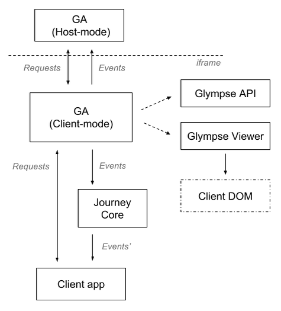
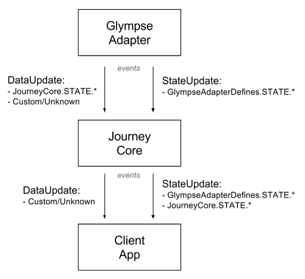

# Glympse Journey (Core)

## Overview
The Glympse Journey Core (GJC) component is the Journey engine, handling all
interaction with the Glympse En Route suite of products. In addition, it handles
all setup and interaction with the [Glympse Adapter] (GA) component, providing an
interface to the Glympse Viewer and handling of external iframe-based hosting
scenarios.


## Structure
The GJC is to be used as the main controller for any web-based EnRoute viewing
experience. It enables interaction with:

- The Glympse Viewer
- The Glympse En Route-generated data stream items
- The Glympse Adapter (used for passing state along to iframe-hosted experiences)
- Custom UI component faciliting the display and interaction with users -- the
  Journey "app"
- Cards-based Journey applications (FUTURE)

A high-level flow is shown below:



It operates on the core premise of EnRoute "phases", which are discrete
instances of a customer's order journey. Please refer to the Glympse EnRoute
programming guide for additional information related to the definition of
each discrete phase instance.


## Configuration
When an instance of the GJC is created, the following configuration object
must be passed to it's constructor, with the following required properties:

 property    | description
:------------|:--------------------------------
**`adapter`**| [Glympse Adapter] options
**`journey`**| _Glympse Journey (Core)_ settings
**`viewer`** | Glympse Viewer configuration

As a reference, the `cfg` parameter of `new JourneyCore(vm, cfg)` has (at a
minimum) the following structure. Note that other app-specific properties
may be present, as they are ignored by the GJC:
```
{
	adapter: {
		// various settings
	},
	journey: {
		// various settings
	},
	viewer: {
		// various settings
	}
}
```


### `adapter` config options
This section defines all of the options to pass in to the [Glympse Adapter]
when it is instantiated. Please refer to the [Glympse Adapter] documentation
for available options.


### `journey` config options
The GJC requires some common core settings to properly support all of its
components that it provides to hosting applications, as described below:

 property | setting | description
:---------|:--------|:--------------
**`dbg`** | _int_ | Set to 0 to enable local debug logging. Any other int value results in no debug output|
**`defaultPhase`** | _string_ | Default phase to use if no phase information is found in the data stream. If not set, starting Phase will be **Live**.
**`elementViewer`** | _string_ | Specifies the selector of the HTML DOM element to place the Glympse Viewer map control
**`etaUpdateInterval`** | _int_ | Time interval (in ms) to update estimated ETA in the absense of ETA in the datastream. Set to <= 0 to disable.
**`mapExpiredToPhase`** | _string_ | If set, sends the phase specified by this setting when an `Expired = true` state update occurs (i.e. moves the app to a particular Phase when the monitored Glympse invite expires). If not set, the `Expired` state update will be propogated to the host app for additional processing.
**`mapPhases`** | _string_ | Maps specified phases to alternate phases then they appear in a Phase update. _For more information, see **Phase Mapping**, below._
**`phaseStateFilter`** | _object_ | _See the **Phase state filter** section, below_
**`snapshotMode`** | _bool_ | Flag to enable _snapshot_ mode, where UI and map displays are synchronized for consistent images generated via Glympse's Snapshot Service. _See the **Snapshot Mode** section, below, for more information._


#### Phase mapping
Based on the use-case/UX scenario, it is sometimes necessary to map an
EnRoute phase to another phase. The `mapPhases` setting allows for direct
mapping when a particular Phase comes through on a Phase state update.

The format of this setting is below:
```
{
	phaseOrig0: mapped_phase0,
	phaseOrig1: mapped_phase1,
	phaseOrigN: mapped_phaseN
}
```
Note that this is a forward-mapping operation, and the original phase will
be lost once mapped. Circular mappings can not be made as the mapping is
only performed once for a given Phase update.


#### Phase state filter
The `phaseStateFilter` parameter specifies state vars to present to the
consuming application when one of their configured phase values occur. It
should be noted that the value of the state var is not lost -- it is
cached with the latest value until a phase state update is matched. Once
this value is sent, the cache for the state var is cleared.

The configuration for `phaseStateFilter` is an object with the following
key/value pairs:

 property | setting | description
:---------|:--------|:--------------
**`state_var_id`**| _Array_of_phase_ids_ | `state_var_id` can be any item found in the `GlympseAdapterDefines.STATE` or `JourneyDefines.STATE` objects. The _Array_of_phase_ids_ is a list of the Phases in which the GJC will broadcast the given state var's current value.

#### Snapshot Mode
When viewing the site through the [Snapshot Service] certain elements are hidden to create a cleaner,
more clear image of the Glympse. To simulate this mode locally, use the query string parameter
`screenOnly=1`. While in this mode, the wrapper `div#divApp` has the class `snapshot` for CSS overrides.


### `viewer` config options
This section of the configuration defines all of the settings to pass in
to the Glympse Viewer when it is instantiated. Please consult your Glympse
representative for additional information on available options.

Note that all normal Glympse Viewer query string options are still
available.


### Feedback `provider` configuration
The `provider` setting specifies the Feedback provider to upload user feedback
submissions. This configuration is passed from the hosting application during
provider object initialization (i.e. it is explicitly not part of the `journey`
config). Below is the current config format to used by GJC's Feedback handler:

 property | setting | description
:---------|:--------|:--------------
**`id`** | _string_ | Name of provider to use. Currently, the only supported provider value is `enroute`.
**`appKey`** | _string_ | Authentication key used to generate submit tokens for given provider.
**`baseUrl`** | _URL_path_ | URL to feedback upload service. $INVITE tokens are replaced with viewed invite.
**`dbg`** | _int_ | Debug setting. Set to > 0 to enable console debug output.
**`surveyId`** | _INT_ | Survey identifier
**`surveyIdInfo`** | _Array_ | Array of additional identifiers to use for a given survey.
**`surveyOptions`** | _Array_ | Optional array of additional options to include with the survey.


## ViewManager setup
After the GJC component is properly set up and initialized with an EnRoute-based
Glympse invite, all of the generated data and information is passed to the
connected ViewManager object.

The ViewManager object is the main controller for all UI/UX behaviors and
flow of the Journey experience. It is the consumer of the GJC and is the final
"app" generated in conjuction with the GJC and all of its subcomponents.

To properly interface with the GJC, the ViewManager must implement the following
public member functions:

method  |description
:-------|:------------
`init(newController, snapshotMode)` | Called during invite initialization, with a reference to the GJC instance to be used for app to GJC notifications and requests. `snapshotMode` is the current setting the GJC is using with respect to running in "snapshot" mode. Returns the number of components that need to initialize before it is ready for viewing (used for UI sync during snapshot mode). Refer below for the exposed GJC APIs.
`cmd(cmd, args)` | A notification or command passed from the GJC controller to update the ViewManager-based app with updates to the EnRoute invite. `cmd` is a predefined identifier, defined either in the `glympse-journey-core.Defines.CMD`, or `glympse-adapter.GlympseAdapterDefines.MSG` namespaces. `args` are the support values associated with the passed `cmd` value. [TO-DO: Outline these in more detail]
`notify(msg, args)` | Though not required, it is recommended to implement this interface for subcomponents of the app that need to bubble up or request some resource from the ViewManager. This is similar to the top-down `cmd` interface (i.e. from GJC to ViewManager), but with a bottom-up approach (i.e. from sub-components to ViewManager). `msg` values are generally custom/internal identifiers, save for some pre-defined message identifiers used in communicating with the GJC instance, or its subcomponents.

## GJC API endpoints
The GJC exposes a single public endpoints to allow for the ViewManager-managed
app to drive the platform aspects of the Journey experience:

    GJCinstance.notify(msg, args);

Identical to the ViewManager `notify` interface described above, the messages/
content passed from the ViewManager to the GJC are used to drive various features
provided by the GJC (i.e., Feedback, Glympse Adapter endpoints, custom external
iframe interfaces, etc.)

### Commands
In addition to all of the commands defined by the GA, the GJC currently only
exposes one new command, which is defined in the
`glympse-journey-core/Defines.CMD.*` object:

id        |args       |info
:---------|:----------|:------
**InitUi**| _object_  |Signals to app that all resources have been loaded and all state is current, passing in additional initialized state. _See **`InitUi` Args** for additional information_.
**ViewerInit**| _object_ |The GJC modifies the args on this [Glympse Adapter]-generated event. _See **`ViewerInit` Args** for more details_.

In general, when the `InitUi` command is received, the hosting application is
safe to begin interfacing with the GJC, GA, and the Glympse viewer, as necessary.

#### `InitUi` Args
The `InitUi` command signals the completion of the initialization of the Glympse
Adapter and the Glympse Viewer. It's arguments contain additional initialization
state that can be used by the hosting application, as needed:

 property | description
:---------|:---------------
**`t`** | Timestamp of when the active Glympse invite was created.
**`adapter`** | Reference to the [Glympse Adapter] instance used to load the given Glympse invite and instantiated Glympse Viewer. Please refer to the [Glympse Adapter] documentation on how to interact with this component.
**`providers`** | An array of all available Feedback provider classes. The items in this array are the constructors to be used to create an instance of a given provider. _Please refer to the **Feedback Provider Setup** section for additional usage information_.

##### Feedback Provider Setup
The following snippet gives an example of how to locate and instantiate a GJC Feedback
provider. `InitUi_CMD_args.providers` was passwd byt by the GJC during initialization
(i.e. this snippet is valid only after the `JourneyDefines.CMD.InitUi` command has been
received):

```javascript
// Search through all providers to find correct one
var providers = InitUi_CMD_args.providers;
var cfgProvider = App_config.provider;
for (var i = 0, len = providers.length; i < len; i++)
{
	if (providers[i].id === cfgProvider.id)
	{
		provider = new providers[i](viewmgr_with_notify_method_ref, cfgProvider);
		break;
	}
}

if (!provider)
{
	// ERROR OUT
}
```

#### `ViewerInit` Args
The [Glympse Adapter]-generated `ViewerInit` command has been augmented by the GJC
to provide additional support during the initialization process:

 property | description
:---------|:---------------
**`adapter`** | Reference to the [Glympse Adapter] instance used to load the given Glympse invite and instantiated Glympse Viewer.
**`args`** | Original args passed by the [Glympse Adapter] for the `ViewerInit` command.


### Messages
Several new Messages have been introduced by the GJC to help with common flow/update
scenarios. These can be referenced via the `glympse-journey-core/Defines.MSG`
object:

 message | description
:--------|:---------------
**`TokenUpdate`** | Message sent from feedback provider to a UI component with respect to Feedback auth token retreival
**`FeedbackSubmitted`** | Message sent from feedback provider to a UI component with respect to Feedback submission status
**`ForcePhase`** | Used by ViewController/app for forced view updates (i.e. demos)
**`ForceAbort`** | Used by ViewController/app for forced view updates (i.e. demos)
**`ComponentLoaded`** | Message sent by the ViewController/app to the GJC instance's notify() method, and used during snapshot mode to ensure UI sync


### States
Additional `StateUpdate` state types have been introduced to ease the use of the
Glympse data stream properties added by the Glympse EnRoute system. All of
these will appear in a `StateUpdate` command for GJC, as shown below:



GJC-specific state types can be referenced in the `glympse-journey-core/Defines.STATE.*`
object. Details about each type are described below:

id               |val         |info
:----------------|:-----------|:------
**ArrivalRange** |`{ from: epoch, to: epoch }`| Specifies the estimated time of arrival range, optional in the owner's timezone, if specified.
**DriverId**     |`custom`| String/JSON-formatted data blob with driver information.
**Duration**     |`duration in ms`| Job duration estimate, in ms
**FutureTime**   |`ETA format`| `eta` data is time (in epoch format) when arrival is expect.
**LastUpdate**   |`epoch`| Time sender last actively updated the Glympse invite.
**OrderInfo**    |`custom`| String/JSON-formatted data blob with order information.
**PromiseTime**  |`ETA format`| `eta` data is the amount of time (in milliseconds) of expected arrival.
**StoreLocation**|`{ lat:.., lng:.., name:.. }`| Position and name of Glympse inviter's origin (i.e. store).
**Visibility**   |`{ location: 'hidden'/'visible' }`| Specifies if sender is actively sharing location/eta information. If '`hidden`', all state of the Glympse invite is invalidated/hidden.


## GJC Feedback component
[TODO: Describe calls/configuration necessary to interact with the Feedback component]


## Putting it all together
To build a stand-alone application that leverages the GJC (and its subcomponents),
the GJC is pulled in as a bower component (i.e. `bower install glympse-journey-core --save`)
to a ViewManager-based project. Note that `jquery` is a required component of the
GJC component system, and must be included with your project.

In conjunction with the ViewManager-driven application, a small wrapper is needed
to properly bind the GJC with your ViewManager object:

	var vm, core;
	var cfg = CONFIG_OBJ;

	$(document).ready(function()
	{
		vm = new ViewManager(cfg.app);		// Create ViewManager instance
		core = new JourneyCore(vm, cfg);	// Create GJC instance, passing in VM instance and running configuration
											// ---> c ore will call vm.init(ref) internally to pass its instance to your VM object
	});

To get you going, the `src/test` directory contains a sample project that illustrates a very basic
setup with a visualization of all of the messages passed from the GJC and its
sub-components, and allows for communication from the ViewManager back to the
GJC instance.

Additionally, there is a [Yeoman](http://yeoman.io/) generator that creates a basic ready-to-go
project GJC-based project. More details can be found at
[https://github.com/Glympse/generator-glympse-journey-app](https://github.com/Glympse/generator-glympse-journey-app).


## Local GJC project setup/build verification
It is actually quite simple really!

First make sure you have node.js installed... without that nothing works!  You can either install it
with your favorite package manager or with [the installer](http://nodejs.org/download) found on
[nodejs.org](http://nodejs.org).

Once you have node set up, you'll need to install app-specific packages to facilitate all of the
automated building for this component:

1. Ensure you are in this project's root directory
2. This project relies on `grunt-cli` and `bower` to do all the heavy lifting for you, so: `npm install -g grunt-cli bower`. Note these will be local project installs, which `grunt` will eventually reference. It isn't enough to just have these packages installed somewhere in your build environment.
3. Now, install all of the base project dependencies: `npm install && bower install`. Again, this must be issue for local project builds. Note that none of the installed packages are committed to `git`.
4. Now you will be able to issue `grunt` to validate changes and generate a build (all output is placed in `dist/`)

Note: Currently, the GJC is intended to be used a bower component for end-user projects. While it will
generate acompiled/minified .js file, it is not currently used. However, the `grunt` command should be
successful before final git submission for users.

For final git submissions for public consumption, the following items should be covered:

- Version information updates:
  - `Gruntfile.js`: `data.config.moduleVersion` with the new [semantic] (MAJOR.MINOR.PATCH) version
  - `bower.json`: `version` property (same value as used above)
- This `README.md` with any relevent changes
- `CHANGELOG.md` should be updated with high-level change info
- `grunt` should return no warnings or errors
  - Note that `grunt` will also generate a compiled version of the GJC component, located in the root `builds/` directory
- git checkin to the repo's master branch, including a tag with the same semantic version used in the config versioning updates, as described above (this allows bower consumers to update to this version)


[Glympse Adapter]: https://github.com/Glympse/glympse-adapter
[semantic]: http://http://semver.org/
